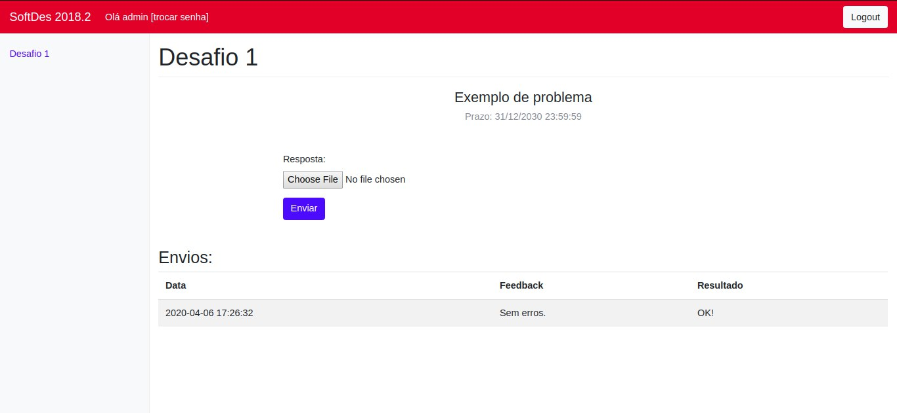
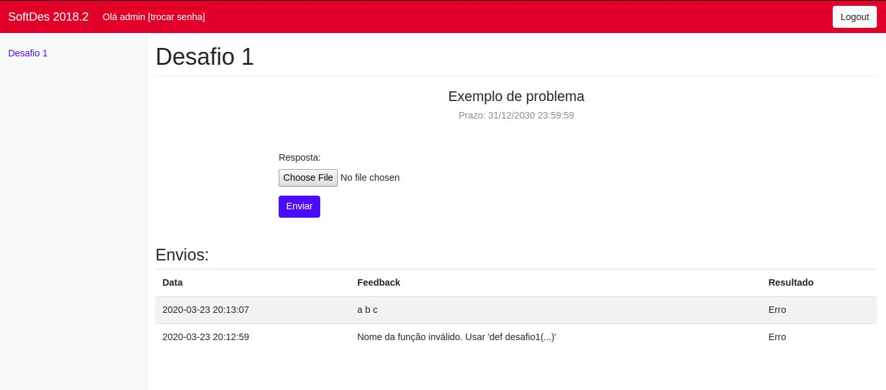

# Documentação de Uso - Aluno

## Entrar no Servidor de Desafios

Entre no link do servidor fornecido pelo host (professor) e faça login com seu usuario do Blackboard (sua senha é a mesma)

## Mudar de Senha

A senha original é pouco segura, então é necessário troca-la usando o botão trocar senha no topo da pagina

## Enviar solução correta

- Escolha o Desafio a ser enviado na aba da esquerda e clique nele. 

- Voce podera escolher um arquivo da sua maquina para enviar como resposta

- clique em enviar

Se aparecer OK! em Resultado, seu exercício está correto

## Enviando uma solução errada

- Teste, agora, com uma solução incorreta. Quando submeter um arquivo incorreto, haverá um feedback a respeito do seu erro e a mensagem de resultado falará Erro

