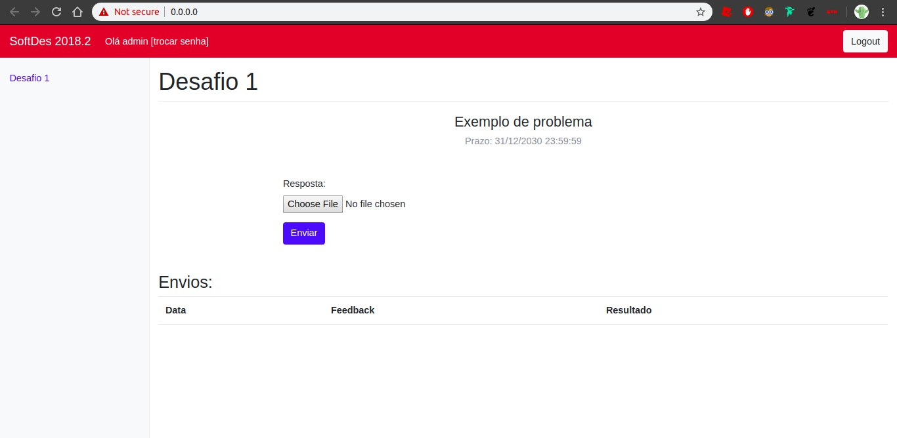

## Servidor para disciplica Desafios de Software

A disciplina de Desafios de Software do Insper possui um servidor para que os alunos possam entregar seus exercícios de programação e serem avaliados com nota.

Este tutorial pretende explicar como rodar este servidor e deixa-lo funcional para que alunos possam usar posteriormente.

É esperado que o aluno, ao se conectar com o servidor, consiga fazer o upload de um arquivo de codigo, em uma atividade especifica de certa data. Ao fazer essa requisição, ele recebe um retorno do servidor falando se o arquivo esta no formato esperado.

### Preview de Uso

Painel Inicial:

